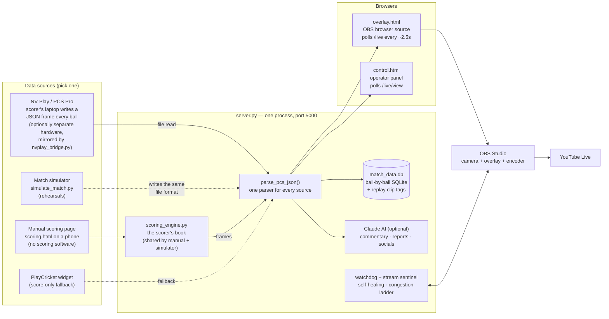
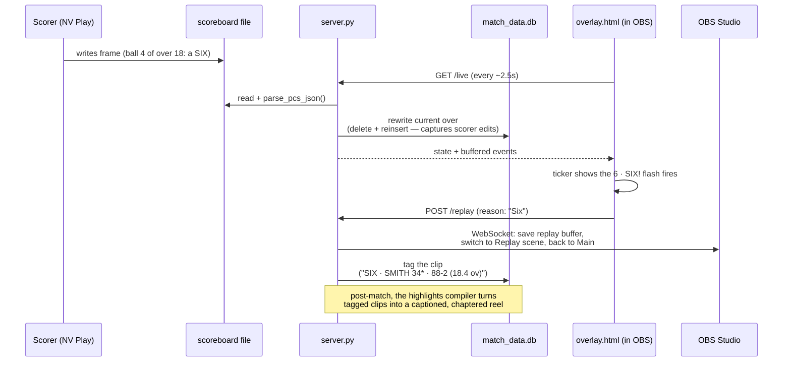

# Architecture

How CricketStream Overlay fits together, for contributors and the technically curious.
The diagrams render automatically on GitHub (they're [Mermaid](https://mermaid.js.org/) —
edit them as text, right here in this file).

The design in one sentence: **everything speaks the NV Play "scoreboard frame" dialect** —
the scorer's file, the manual scoring page, and the match simulator all produce the same
frame shape, so the overlay, graphics, ball database, replays and highlights work
identically no matter where the data comes from.

---

## The big picture

Key decisions baked into that shape:

- **The server must run next to the scorer's output file**, so it can never be a cloud
  service — remote *operation* (Tailscale / Cloudflare Tunnel to the panel and scoring
  page) is what's exposed instead.
- **NV Play can run on hardware separate from the server** via `nvplay_bridge.py`, which
  serves the scorer's file over HTTP; the server mirrors it into a local cache folder every
  ~2s, becoming an ordinary local file before `parse_pcs_json()` — or anything else — ever
  sees it. Built so the streaming machine doesn't have to carry a scorer's VM's CPU/heat
  load alongside OBS.
- **`/live` is the overlay's poll and drives all side effects** (event detection, ball
  logging, commentary triggers, consuming the wicket-event buffer). Every other consumer
  uses the read-only `/live/view` — exactly one client owns the pipeline.
- **Manual scoring and the simulator share `scoring_engine.py`**, a deterministic
  "scorer's book". Determinism is load-bearing: the scoring page's undo replays the event
  log and must reproduce the book exactly (tests assert frame-for-frame equality).

---

## One ball's journey

Two subtleties worth knowing (they've caused real bugs):

- **The ticker clears on the over-completing write.** NV Play never shows the finished
  over's ticker for an extra poll, so the final ball of every over is invisible in the
  ticker. The overlay recovers it from the score delta for graphics, and the ball logger
  recovers it the same way for the database.
- **Innings 2 is detected by `runs_required > 0`, latched** — because it drops back to 0
  the instant the winning runs are hit, which would otherwise "end" the innings early.

---

## Module map

| Piece | Role |
|---|---|
| `server.py` | The whole backend: HTTP server, parsing, ball DB, replays/highlights, AI, auth, watchdog, stream sentinel, manual-scoring session |
| `overlay.html` | The broadcast layer (1920×1080 OBS browser source) — scorebar, cards, milestones, worm, replays. Pure client-side JS |
| `control.html` | Operator panel served at `/control` (kit colours, toggles, roster, health, highlights, stream quality) |
| `scoring.html` | Manual ball-by-ball scoring page at `/scoring` — event-sourced, undo-exact, restart-safe |
| `scoring_engine.py` | Deterministic innings engine shared by manual scoring and the simulator |
| `simulate_match.py` | Rehearsal harness: complete simulated matches written as real feed frames (`--chaos` for failure drills) |
| `scoreboard.template` | What NV Play fills in — the contract every source imitates |
| `nvplay_bridge.py` | Standalone stdlib script: serves NV Play's file over HTTP when it's on separate hardware from the server |
| `obs_setup.py` / `quickstart.py` / `setup_wizard.py` | OBS auto-config · match-day launcher · first-run wizard |
| `tests/` | 165 stdlib-unittest tests, including a full-match soak that reconciles the ball DB against the engine's book |

### Security model, briefly

Auth is optional on localhost and mandatory the moment the server binds beyond it: a club
password exchanged for HMAC-signed, expiring session tokens (Bearer-only — no cookies, so
nothing for a cross-site page to ride on), login lockout, an origin check on every POST,
and secret redaction on `/state`. The overlay itself never logs in — endpoints it must
call trust genuine loopback connections only (a proxied `X-Forwarded-For` request doesn't
count).

---

*Diagrams live in this file as Mermaid — if you change the architecture, change the
picture in the same commit.*
