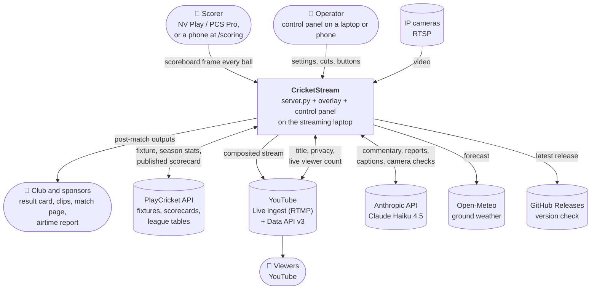
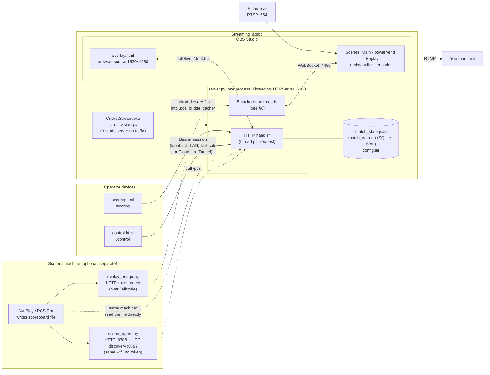
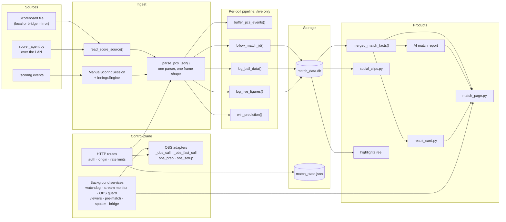
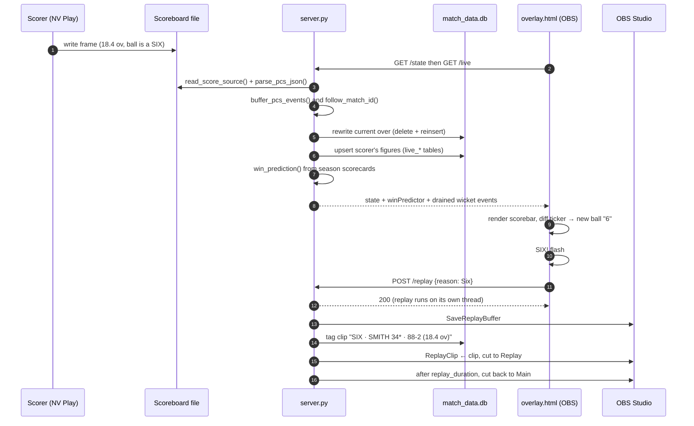
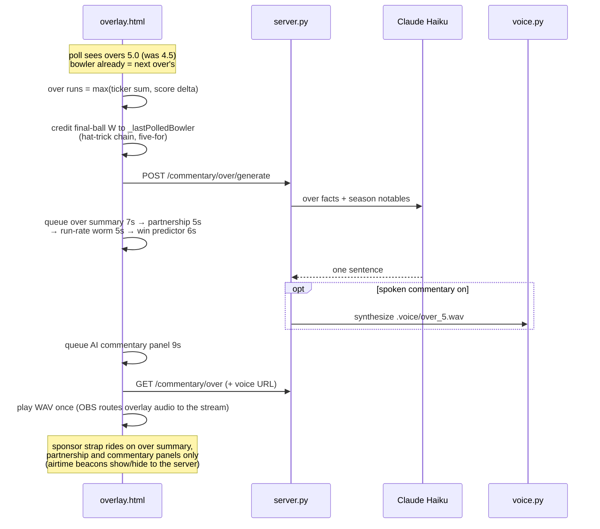
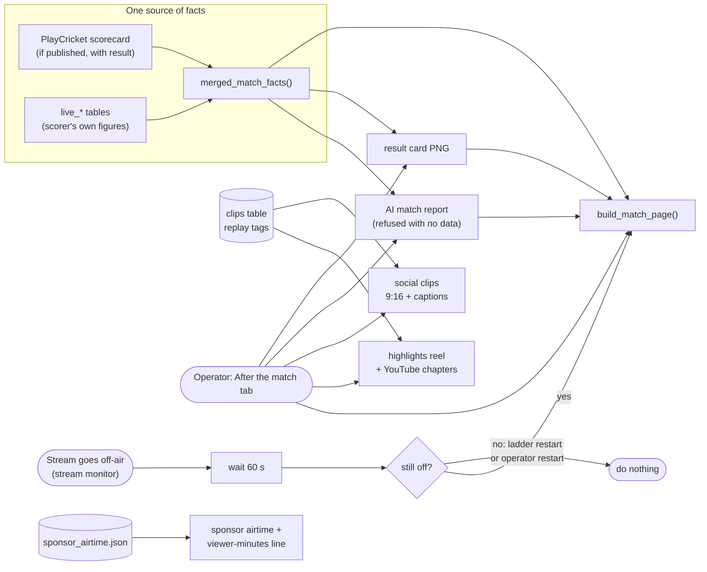
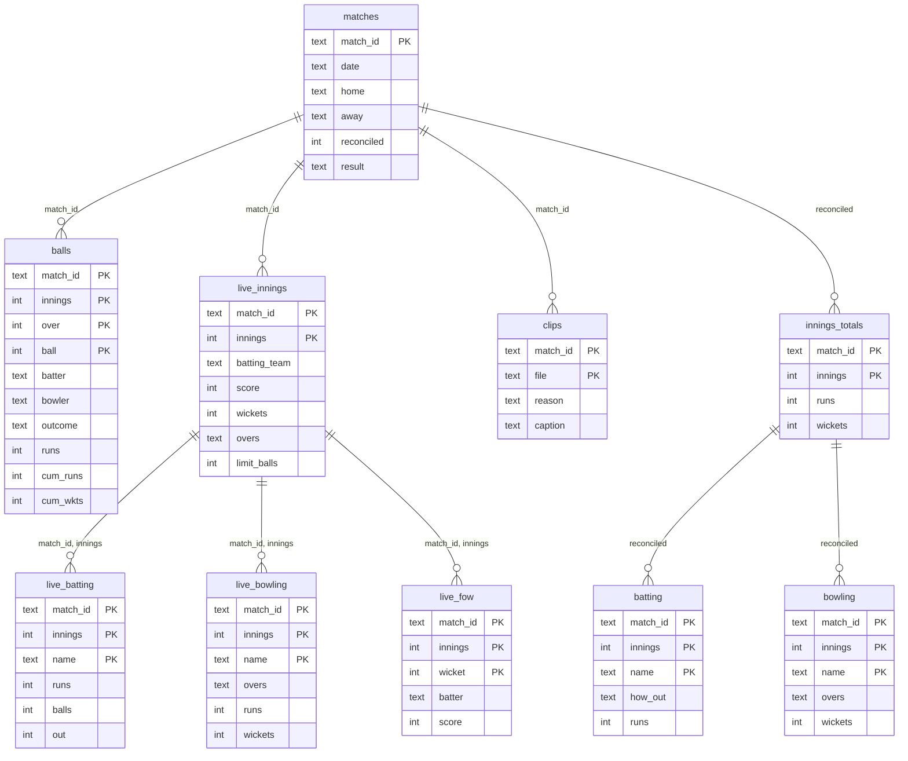
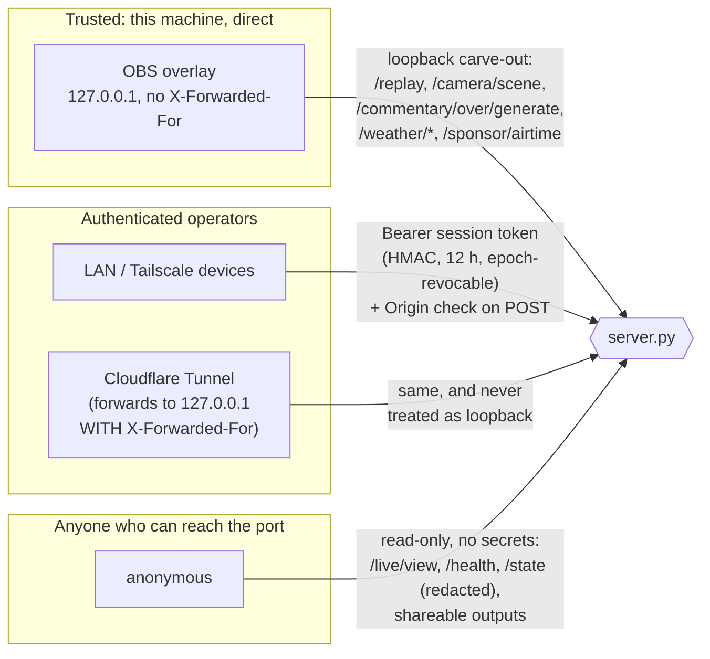

# Architecture

How CricketStream fits together, for contributors and the technically curious. Every
diagram is [Mermaid](https://mermaid.js.org/) and renders on GitHub; edit it as text in
this file. **If you change the architecture, change the picture in the same commit.**

The document follows the usual system-design views, outside in:

1. [Purpose and quality drivers](#1-purpose-and-quality-drivers): what the design is optimised for
2. [System context](#2-system-context): people and external systems
3. [Deployment view](#3-deployment-view): what runs on which machine
4. [Component view](#4-component-view): inside `server.py` and the browser clients
5. [Runtime views](#5-runtime-views): a ball, an over, a replay, the end of the match
6. [Concurrency view](#6-concurrency-view): every background thread and its cadence
7. [Data view](#7-data-view): files, the SQLite schema, what survives a restart
8. [Failure and recovery](#8-failure-and-recovery): what breaks on a match day and what happens next
9. [Security view](#9-security-view): trust boundaries and how each is enforced
10. [Interface catalogue](#10-interface-catalogue): the HTTP surface
11. [Design decisions](#11-design-decisions): the choices, why, and what was rejected
12. [Invariants](#12-invariants): rules that have each been broken once, and must not be again

---

## 1. Purpose and quality drivers

A free broadcast-graphics system for grassroots cricket. The volunteer running it is
not technical, and nobody is at the laptop for most of the match. The scorer's software
writes a file every ball. A Python server turns that file into live graphics inside OBS,
and OBS streams to YouTube.

The design in one sentence: **every score source speaks the NV Play "scoreboard frame"
dialect.** The scorer's file, the phone scoring page and the match simulator all produce the
same frame, so every downstream feature works the same whatever the source.

| Driver | What it means here | Where it shows |
|---|---|---|
| **The stream must not stop** | Nothing optional may take the broadcast down | Logging never raises; each overlay stage is isolated in its own try/catch; OBS crash and freeze recovery; quickstart restarts a crashed server |
| **Unattended** | Nobody at the laptop to click a dialog | OBS's Safe Mode and update prompts are pre-empted; a detected checklist; a pre-match check that runs itself |
| **Runs on an old laptop that is also encoding video** | CPU headroom belongs to OBS | Stdlib HTTP server; mtime-cached state; post-match video work at below-normal priority; no encoding mid-match |
| **Correct numbers, never invented ones** | A wrong score on a public result card is worse than none | Facts come from the scorer's own figures or PlayCricket; AI only writes prose around them, and is refused when there's no data |
| **Volunteer-proof** | Setup by double-click; failures explained in words | One launcher; every fatal path pauses with a plain explanation; a ✓/⚠/✗ pre-match check |
| **Cheap** | Free to run; AI optional, priced in pence | Claude Haiku throughout; every AI feature has a non-AI fallback or is opt-in |

---

## 2. System context

```mermaid
flowchart TB
    scorer(["👤 Scorer<br/>NV Play / PCS Pro,<br/>or a phone at /scoring"])
    operator(["👤 Operator<br/>control panel on a laptop or phone"])
    viewers(["👥 Viewers<br/>YouTube"])
    club(["👥 Club and sponsors<br/>result card, clips, match page,<br/>airtime report"])

    cs["<b>CricketStream</b><br/>server.py + overlay + control panel<br/>on the streaming laptop"]

    pc[("PlayCricket API<br/>fixtures, scorecards,<br/>league tables")]
    yt[("YouTube<br/>Live ingest (RTMP)<br/>+ Data API v3")]
    ai[("Anthropic API<br/>Claude Haiku 4.5")]
    meteo[("Open-Meteo<br/>ground weather")]
    gh[("GitHub Releases<br/>version check")]
    cams[("IP cameras<br/>RTSP")]

    scorer -- "scoreboard frame every ball" --> cs
    operator -- "settings, cuts, buttons" --> cs
    cs -- "composited stream" --> yt --> viewers
    cs -- "post-match outputs" --> club
    cams -- "video" --> cs
    cs <-->|"fixture, season stats,<br/>published scorecard"| pc
    cs <-->|"title, privacy,<br/>live viewer count"| yt
    cs <-->|"commentary, reports,<br/>captions, camera checks"| ai
    cs -- "forecast" --> meteo
    cs -- "latest release" --> gh
```

Every external system is optional apart from YouTube. With no internet beyond the
stream, the scorebar, replays, highlights and ball database all still work.

---

## 3. Deployment view

```mermaid
flowchart LR
    subgraph SCORE["Scorer's machine (optional, separate)"]
        nv["NV Play / PCS Pro<br/>writes scoreboard file"]
        agent["scorer_agent.py<br/>HTTP :8788 + UDP discovery :8787<br/>(same wifi, no token)"]
        bridge["nvplay_bridge.py<br/>HTTP, token-gated<br/>(over Tailscale)"]
        nv --> agent
        nv --> bridge
    end

    subgraph STREAM["Streaming laptop"]
        launcher["CricketStream.exe<br/>→ quickstart.py<br/>(restarts server up to 3×)"]
        subgraph PY["server.py: one process, ThreadingHTTPServer :5000"]
            http["HTTP handler<br/>(thread per request)"]
            bg["8 background threads<br/>(see §6)"]
        end
        subgraph OBSBOX["OBS Studio"]
            ov["overlay.html<br/>browser source 1920×1080"]
            scenes["Scenes: Main · bowler-end · Replay<br/>replay buffer · encoder"]
        end
        files[("match_state.json<br/>match_data.db (SQLite, WAL)<br/>config.ini")]
        launcher --> PY
        ov <-->|"poll /live 2.5–3.5 s"| http
        bg <-->|"WebSocket :4455"| scenes
        http --- files
    end

    subgraph OPS["Operator devices"]
        panel["control.html<br/>/control"]
        phone["scoring.html<br/>/scoring"]
    end

    cams["IP cameras<br/>RTSP :554"] --> scenes
    agent -. "pull /pcs" .-> http
    bridge -. "mirrored every 2 s<br/>into .pcs_bridge_cache/" .-> bg
    nv -. "same machine:<br/>read the file directly" .-> http
    panel -- "Bearer session<br/>(loopback, LAN, Tailscale<br/>or Cloudflare Tunnel)" --> http
    phone --> http
    scenes -- "RTMP" --> yt["YouTube Live"]
```

**Why the server can never be a cloud service:** it has to read a file on the scorer's
machine and drive the OBS on the streaming laptop. Remote *operation* is what's exposed
instead: Tailscale (recommended) or an opt-in Cloudflare quick tunnel. Both require a club
password.

**Three ways to reach the scorer's file**, behind one function (`read_score_source()`):

| Mode | When | Transport | Auth |
|---|---|---|---|
| `local` | NV Play on the streaming laptop | file read | n/a |
| `local` + bridge | NV Play elsewhere, different network | `nvplay_bridge.py` over Tailscale, mirrored to `.pcs_bridge_cache/` | shared token |
| `agent` | Two laptops on the same club wifi | `scorer_agent.py`, found by UDP broadcast | none (broadcast domain only) |

A live manual-scoring session (`/scoring`) outranks all three.

---

## 4. Component view

### 4.1 Inside `server.py`

Data flows left to right: sources, one ingest door, the per-poll pipeline, storage, and
the products built from it. The control plane (HTTP routes, background services, OBS
adapters) sits underneath and drives the rest.

```mermaid
flowchart LR
    subgraph SRC["Sources"]
        f1["Scoreboard file<br/>(local or bridge mirror)"]
        f2["scorer_agent.py<br/>over the LAN"]
        f3["/scoring events"]
    end

    subgraph ING["Ingest"]
        rss["read_score_source()"]
        man["ManualScoringSession<br/>+ InningsEngine"]
        parse["parse_pcs_json()<br/>one parser, one frame shape"]
    end

    subgraph PIPE["Per-poll pipeline: /live only"]
        ev["buffer_pcs_events()"]
        fm["follow_match_id()"]
        lb["log_ball_data()"]
        lf["log_live_figures()"]
        wp["win_prediction()"]
    end

    subgraph STORE["Storage"]
        db[("match_data.db")]
        st[("match_state.json")]
    end

    subgraph PROD["Products"]
        facts["merged_match_facts()"]
        rep["AI match report"]
        card["result_card.py"]
        page["match_page.py"]
        clips["social_clips.py"]
        hl["highlights reel"]
    end

    subgraph CTRL["Control plane"]
        routes["HTTP routes<br/>auth · origin · rate limits"]
        svc["Background services<br/>watchdog · stream monitor · OBS guard<br/>viewers · pre-match · spotter · bridge"]
        obsio["OBS adapters<br/>_obs_call · _obs_fast_call<br/>obs_prep · obs_setup"]
    end

    f1 --> rss
    f2 --> rss
    f3 --> man
    rss --> parse
    man --> parse
    parse --> ev
    parse --> fm
    parse --> lb
    parse --> lf
    parse --> wp
    fm --> db
    lb --> db
    lf --> db
    db --> facts
    facts --> rep
    facts --> card
    facts --> page
    rep --> page
    card --> page
    db --> clips
    db --> hl
    routes --> parse
    routes --> st
    svc --> obsio
    routes --> obsio
    svc --> page
```

| Module | Responsibility | Pure? |
|---|---|---|
| `server.py` | HTTP surface, ingest, ball DB, OBS control, background services, auth | no |
| `scoring_engine.py` | Deterministic scorer's book: strike rotation, extras, dismissals, figures, frame rendering | yes |
| `win_predictor.py` | DLS-shaped resources × this season's scoring, normal-distribution totals; `backtest()` | yes |
| `result_card.py` | Result card PNG from facts + look (Pillow, bundled fonts) | yes |
| `match_page.py` | Self-contained HTML match page; everything HTML-escaped | yes |
| `social_clips.py` | 1080×1920 ffmpeg filter graph; text only via `textfile=` | yes (+ ffmpeg) |
| `voice.py` | Text to WAV with the OS voice; text always via a file | yes (+ OS TTS) |
| `logo_bg.py` | Transparent background for sponsor logos | yes |
| `obs_prep.py` | OBS config files while OBS is closed; launch, close, crash marker, freeze ping | no |
| `obs_setup.py` | Scenes, sources, stream key over the WebSocket | no |
| `quickstart.py` / `cricketstream.py` / `setup_wizard.py` | Launch chain and installer | no |
| `scorer_agent.py` / `nvplay_bridge.py` | Standalone, stdlib-only, no import of `server.py` | no |
| `simulate_match.py` | Rehearsal feed: real NV Play quirks, `--chaos` failures | no |

The pure modules are the ones with deep test coverage. `server.py` gathers inputs and
hands them over, so the logic can be tested without a server, OBS or a network.

### 4.2 Browser clients

| Client | Served at | Polls | Side effects allowed |
|---|---|---|---|
| `overlay.html` (OBS) | `/overlay` | `/state` + `/live` every 2.5–3.5 s, `/commands` every 3 s | **Yes: the only client of `/live` and `/commands`** |
| `overlay.html?preview=1` | iframe in the panel | one `/state` read, then never again | None |
| `control.html` | `/control` | `/live/view`, `/health` (10 s), checklist, stream monitor (10 s), spotter (60 s)… | Operator POSTs only |
| `scoring.html` | `/scoring` | `/scoring/state` (5 s) | Ball events |

The overlay's graphics are one DOM with a queue (`queueGraphic` → `nextGraphic`). Panels
show one at a time, and every stage is wrapped so one failing graphic can't stall the
queue.

---

## 5. Runtime views

### 5.1 One ball

```mermaid
sequenceDiagram
    autonumber
    participant S as Scorer (NV Play)
    participant F as Scoreboard file
    participant SV as server.py
    participant DB as match_data.db
    participant OV as overlay.html (OBS)
    participant OBS as OBS Studio

    S->>F: write frame (18.4 ov, ball is a SIX)
    OV->>SV: GET /state then GET /live
    SV->>F: read_score_source() + parse_pcs_json()
    SV->>SV: buffer_pcs_events() and follow_match_id()
    SV->>DB: rewrite current over (delete + reinsert)
    SV->>DB: upsert scorer's figures (live_* tables)
    SV->>SV: win_prediction() from season scorecards
    SV-->>OV: state + winPredictor + drained wicket events
    OV->>OV: render scorebar, diff ticker → new ball "6"
    OV->>OV: SIX! flash
    OV->>SV: POST /replay {reason: Six}
    SV-->>OV: 200 (replay runs on its own thread)
    SV->>OBS: SaveReplayBuffer
    SV->>DB: tag clip "SIX · SMITH 34* · 88-2 (18.4 ov)"
    SV->>OBS: ReplayClip ← clip, cut to Replay
    SV->>OBS: after replay_duration, cut back to Main
```

### 5.2 The end of an over

The over-completing write is the hardest moment in the feed. On that write NV Play has
**already rotated the bowler and swapped the batters' ends**, and it **usually keeps
showing the over as it was before its final ball**. The final delivery is therefore
recovered from the score delta and credited from the previous poll's snapshot.

```mermaid
sequenceDiagram
    participant OV as overlay.html
    participant SV as server.py
    participant AI as Claude Haiku
    participant TTS as voice.py

    Note over OV: poll sees overs 5.0 (was 4.5)<br/>bowler already = next over's
    OV->>OV: over runs = max(ticker sum, score delta)
    OV->>OV: credit final-ball W to _lastPolledBowler<br/>(hat-trick chain, five-for)
    OV->>SV: POST /commentary/over/generate
    SV->>AI: over facts + season notables
    OV->>OV: queue over summary 7s → partnership 5s<br/>→ run-rate worm 5s → win predictor 6s
    AI-->>SV: one sentence
    opt spoken commentary on
        SV->>TTS: synthesize .voice/over_5.wav
    end
    OV->>OV: queue AI commentary panel 9s
    OV->>SV: GET /commentary/over (+ voice URL)
    OV->>OV: play WAV once (OBS routes overlay audio to the stream)
    Note over OV: sponsor strap rides on over summary,<br/>partnership and commentary panels only<br/>(airtime beacons show/hide to the server)
```

### 5.3 Post-match products

```mermaid
flowchart LR
    endst(["Stream goes off-air<br/>(stream monitor)"]) --> wait["wait 60 s"]
    wait --> still{"still off?"}
    still -- "no: ladder restart<br/>or operator restart" --> skip(["do nothing"])
    still -- yes --> mp["build_match_page()"]

    subgraph FACTS["One source of facts"]
        pcf["PlayCricket scorecard<br/>(if published, with result)"]
        live["live_* tables<br/>(scorer's own figures)"]
        mf["merged_match_facts()"]
        pcf --> mf
        live --> mf
    end

    mf --> mp
    mf --> rc["result card PNG"]
    mf --> rpt["AI match report<br/>(refused with no data)"]
    rpt --> mp
    rc --> mp
    clipsdb[("clips table<br/>replay tags")] --> sc["social clips<br/>9:16 + captions"]
    clipsdb --> hlr["highlights reel<br/>+ YouTube chapters"]
    air[("sponsor_airtime.json")] --> spr["sponsor airtime +<br/>viewer-minutes line"]

    op(["Operator: After the match tab"]) --> rc & rpt & sc & hlr & mp
```

---

## 6. Concurrency view

One process, one interpreter. The HTTP server gives every request its own thread
(`daemon_threads`, `request_queue_size = 64`: a burst of reconnecting pollers was refused
at the OS level with the default of 5). Long-lived work runs on dedicated daemon threads,
each with a loop that catches everything and never dies:

| Thread | Cadence | Does | If it fails |
|---|---|---|---|
| `_watchdog_loop` | 90 s | Unsticks the season-stats build, restarts a dead Cloudflare tunnel, trims rate-limit state, logs feed staleness and Mac thermal throttling | Logs, retries next tick |
| `_stream_monitor_loop` | 15 s | OBS stream status, congestion samples, quality-ladder decision, stream-end trigger for the match page | Marks OBS unreachable |
| `_obs_guard_loop` | 5 s | OBS crash (sentinel present) → reopen, scene, restart stream if it was live; freeze (window hung 60 s **and** bytes not moving) → kill → reopen | Capped at 3 reopens / 30 min, then a human |
| `_viewer_loop` | 60 s, live only | YouTube concurrent viewers for sponsor viewer-minutes | Count goes stale (>3 min) and is not used |
| `_precheck_loop` | 30 s after start, then 6 h | All pre-match checks in parallel, 20 s budget | A check that errors is reported ✗, never raised |
| `_spotter_loop` | 60 s tick, check every N min, live only | Camera screenshots → frozen check → Claude Haiku | "Couldn't check", never a false camera problem |
| `_pcs_bridge_sync_loop` | 2 s, bridge mode only | Mirrors the remote file atomically, keeps its mtime | Holds the last mirror |
| Cloudflare reader | event-driven | Captures the tunnel URL | Watchdog restarts the tunnel |

Short-lived worker threads: replay (one per trigger), AI over commentary, match page,
social clips, highlights, the checklist's Start OBS job, season-stats build, league table.

**Shared-state rules.** `save_state()` is serialised (`_state_write_lock`) and atomic.
Any read-modify-write goes through `update_state()` (`_state_rmw_lock`). The DB is
reached through `_db_lock` with WAL. Job flags ("already building") are set under a
lock. The overlay-facing event buffer is drained under `_event_buffer_lock`, so an event
arriving mid-drain is never lost.

---

## 7. Data view

### 7.1 Files

| File | Holds | Written by | Survives restart | Git |
|---|---|---|---|---|
| `config.ini` | Club identity, keys, OBS/stream policy, auth | setup wizard, `obs_prep` | yes | ignored |
| `match_state.json` | Everything the panel edits | `save_state` (atomic, mtime-cached reads) | yes | ignored |
| `match_data.db` | Ball log, live figures, replay tags, reconciled scorecards | loggers | yes | ignored |
| `manual_scoring.json` | `/scoring` event log | every action | yes, replayed on load | ignored |
| `season_stats_cache.json` | Season batting lookup + `innings_history` for the win model | daily build | yes (same day) | ignored |
| `sponsor_airtime.json` | Per-day on-air seconds, shows, viewer-minutes | airtime beacon | yes | ignored |
| `match_pages/`, `.voice/`, replay folder | Post-match outputs, spoken lines (last 20), clips | jobs | yes | ignored |

### 7.2 Database schema

```mermaid
erDiagram
    matches ||--o{ balls : "match_id"
    matches ||--o{ live_innings : "match_id"
    live_innings ||--o{ live_batting : "match_id, innings"
    live_innings ||--o{ live_bowling : "match_id, innings"
    live_innings ||--o{ live_fow : "match_id, innings"
    matches ||--o{ clips : "match_id"
    matches ||--o{ innings_totals : "reconciled"
    innings_totals ||--o{ batting : "reconciled"
    innings_totals ||--o{ bowling : "reconciled"

    matches {
        text match_id PK
        text date
        text home
        text away
        int reconciled
        text result
    }
    balls {
        text match_id PK
        int innings PK
        int over PK
        int ball PK
        text batter
        text bowler
        text outcome
        int runs
        int cum_runs
        int cum_wkts
    }
    live_innings {
        text match_id PK
        int innings PK
        text batting_team
        int score
        int wickets
        text overs
        int limit_balls
    }
    live_batting {
        text match_id PK
        int innings PK
        text name PK
        int runs
        int balls
        int out
    }
    live_bowling {
        text match_id PK
        int innings PK
        text name PK
        text overs
        int runs
        int wickets
    }
    live_fow {
        text match_id PK
        int innings PK
        int wicket PK
        text batter
        int score
    }
    clips {
        text match_id PK
        text file PK
        text reason
        text caption
    }
    innings_totals {
        text match_id PK
        int innings PK
        int runs
        int wickets
    }
    batting {
        text match_id PK
        int innings PK
        text name PK
        text how_out
        int runs
    }
    bowling {
        text match_id PK
        int innings PK
        text name PK
        text overs
        int wickets
    }
```

Three layers, in increasing order of authority:

1. **`balls`** is a reconstruction from the ticker. It is good for the worm and
   ball-by-ball CSV, but its `batter` column is whoever was batter1 at the over's last
   write.
2. **`live_*`** holds the scorer's own running figures, upserted every frame. These are
   exact, and they are what reports, result cards and the match page read.
3. **`innings_totals` / `batting` / `bowling`** hold PlayCricket's published scorecard,
   written by Reconcile. They are the record of truth after the match.

`match_id` is the PlayCricket id once known, else `date_home_v_away`. Every table keyed
by it is listed in `_MATCH_TABLES`, so `follow_match_id()` can move a match's rows when the
id changes mid-innings.

---

## 8. Failure and recovery

| Failure | Detected by | Automatic response | Operator sees |
|---|---|---|---|
| Scorer's file mid-write or corrupt | parse fails | Hold the last good frame | Nothing |
| Scorer feed stops | watchdog, `/health` | Overlay keeps the last score | "feed stale" in the health strip |
| Scorer's laptop (agent) unreachable | `read_agent_file` | Last score for 120 s, then rediscover every 15 s | Agent status + checklist button |
| OBS crashes | OBS guard: port down + crash sentinel | Clear sentinel, reopen past Safe Mode, Main scene, restart stream **only if it was live** | Event in `/health` → `obs_recovery` |
| OBS freezes | Window hung 60 s **and** stream bytes not moving | Force-close → treated as a crash | Same |
| OBS frozen but still streaming | Bytes moving | **Left alone** (killing it would cause the outage) | Warning |
| Upload congested | Stream monitor: 60 s congestion/drops | OBS dynamic bitrate; optional quality ladder down (never up on its own) | Monitor card, step history |
| server.py crashes | quickstart | Relaunch up to 3× with backoff | Console |
| State file unreadable | `load_state` | Last good copy, else defaults | Console warning |
| YouTube login expired | refresh error | Say so; never open a login mid-match | Pre-match check ✗ |
| Anthropic unavailable | API error | Commentary skipped; captions fall back to templates | Nothing on air |
| Camera fogged or knocked | Camera spotter (opt-in) | None (can't wipe a lens) | Red camera badge in the pinned bar |
| Leftover quality downshift | Pre-match check, `/health` | Quickstart resets the bitrate on next start | ⚠/✗ before going live |

The rule behind the table: **automate what is safe to repeat, never what could put the
club on air by surprise.** The stream is only restarted when OBS itself said it was live
just before the crash. A normal close is never undone. A congested stream is never
stepped *up* automatically.

---

## 9. Security view

```mermaid
flowchart LR
    subgraph T0["Trusted: this machine, direct"]
        obsov["OBS overlay<br/>127.0.0.1, no X-Forwarded-For"]
    end
    subgraph T1["Authenticated operators"]
        lan["LAN / Tailscale devices"]
        cf["Cloudflare Tunnel<br/>(forwards to 127.0.0.1<br/>WITH X-Forwarded-For)"]
    end
    subgraph T2["Anyone who can reach the port"]
        anon["anonymous"]
    end

    srv{{"server.py"}}
    obsov -- "loopback carve-out:<br/>/replay, /camera/scene,<br/>/commentary/over/generate,<br/>/weather/*, /sponsor/airtime" --> srv
    lan -- "Bearer session token<br/>(HMAC, 12 h, epoch-revocable)<br/>+ Origin check on POST" --> srv
    cf -- "same, and never<br/>treated as loopback" --> srv
    anon -- "read-only, no secrets:<br/>/live/view, /health, /state (redacted),<br/>shareable outputs" --> srv
```

- **Auth is off on a localhost-only install and required beyond it.** Binding to anything
  but 127.0.0.1 without a club password falls back to 127.0.0.1.
- **Sessions:** the password is exchanged for `expiry:nonce:HMAC(control_token+epoch)`.
  Tokens are Bearer only, never cookies, so a cross-site page has nothing to ride on.
  "Log everyone out" rotates the epoch. Five failures in 10 minutes lock that client out.
- **Secrets never reach a browser.** `/state` replaces each key in `SECRET_KEYS` with a
  sentinel, and a POST carrying the sentinel leaves the stored value alone.
- **Inputs are distrusted:** uploads are typed by magic bytes (never SVG). Paths are
  reduced to a basename. AI text and player names are escaped in every HTML sink. Text
  reaches ffmpeg and the speech engine only via files, never argv or a filter string.
- **Shareable outputs are open by design:** result card, social clips, match page, sponsor
  airtime. They contain nothing that isn't already meant for the public.

---

## 10. Interface catalogue

| Group | Endpoints | Access |
|---|---|---|
| Pages | `/overlay`, `/control`, `/scoring` | open (the panel asks for a login when a password is set) |
| Live feed | `/live` *(overlay only, mutating)*, `/live/view`, `/state` GET, `/commands` *(pops)* | open, secrets redacted |
| Settings | `/state` POST, `/login`, `/auth/logout_all`, `/auth/log` | token |
| Overlay actions | `/replay`, `/camera/scene`, `/commentary/over/generate`, `/weather/show`, `/weather/hide`, `/sponsor/airtime` POST | loopback or token |
| Match day | `/checklist`, `/checklist/action`, `/match/fetch`, `/obs/add_camera`, `/stream/quality`, `/stream/dynamic`, `/youtube/update`, `/camera/spotter`, `/precheck`, `/precheck/last` | token |
| Manual scoring | `/scoring/setup`, `/scoring/{ball,undo,edit,bowler,batter,strike,innings,reset}`, `/scoring/state`, `/scoring/balls`, `/scoring/scorecard` | token for writes |
| Stats and context | `/player/stats`, `/season/top`, `/league/table`, `/weather`, `/headshot/*`, `/logo/*`, `/sponsor/*` | open |
| After the match | `/report/generate`, `/social/image/generate`, `/social/recent`, `/social/clips`, `/match/page`, `/highlights`, `/data/export`, `/data/reconcile` | token |
| Shareable outputs | `/social/image/latest`, `/social/clips/file/*`, `/match/page/latest`, `/sponsor/airtime` GET | open |
| Diagnostics | `/health`, `/status`, `/stream/monitor`, `/pcs/debug`, `/logos/debug`, `/data/status`, `/agent/status`, `/remote/info` | open |

Routing rule: exact paths are matched before prefixes (`/sponsor/airtime` before
`/sponsor/<id>`).

---

## 11. Design decisions

| # | Decision | Why | Rejected alternative |
|---|---|---|---|
| D1 | One frame dialect for every source | Every feature written once and tested against one shape | Per-source adapters downstream |
| D2 | `/live` mutates; everything else reads `/live/view` | The pipeline needs exactly one clock: the overlay's poll | A server-side poll loop (a second clock to keep in step) |
| D3 | Stdlib `ThreadingHTTPServer`, connection-per-call OBS | No dependencies to install; nothing long-lived to wedge after an OBS restart | asyncio/web framework; one persistent OBS socket for everything |
| D4 | Held-open OBS socket for camera cuts only | Cuts 3.6× quicker; reconnect-on-error keeps it safe | Using it for everything |
| D5 | OBS settings edited as files while OBS is closed | OBS has no API for them, and overwrites them on exit if open | Driving the settings UI; editing while running |
| D6 | Event-sourced manual scoring over a deterministic engine | Exact undo and edit; restart resumes mid-over | Mutable scorecard with patch-up undo |
| D7 | Scorer's figures (`live_*`) for every published fact; AI writes prose only | A made-up score on a public card is the worst failure | Asking the model for the result |
| D8 | Win model from the league's own season, backtested | Honest for the level of cricket being played | Professional-cricket priors |
| D9 | Post-match video work after the stream, below-normal priority | x264 on the same laptop competes with OBS's encoder | Rendering clips as replays happen |
| D10 | Opt-in for anything that costs money or speaks on air | Volunteers must never be surprised by a bill or a voice | On by default |
| D11 | Server stays on the club laptop; remote access via Tailscale/Cloudflare | It must read the scorer's file and drive the local OBS | A cloud relay (scoped, not built) |

---

## 12. Invariants

Each of these was broken once and fixed. `CLAUDE.md` has the full story for each.

1. Only the OBS overlay calls `/live` and `/commands`. Preview mode makes one `/state`
   read and nothing else.
2. Every score-feed consumer goes through `read_score_source()` / `effective_pcs_folder()`,
   and honours a live manual session first.
3. Nothing in the match-day loop may raise. Logging is wrapped; overlay stages are isolated.
4. State writes are atomic and serialised. Read-modify-write goes through `update_state()`.
5. On the over-completing write, the bowler and ends have already rotated. Credit the final
   ball from the previous poll's snapshot. Match each ticker to the over it belongs to.
6. A new `match_id`-keyed table must be added to `_MATCH_TABLES`.
7. Endpoints the overlay calls need the loopback carve-out. Endpoints that start OBS or go
   live must never get it.
8. No club identity in defaults. No secrets in git (globbed ignores).
9. Never test against the real OBS install. Use a portable copy only.
10. `overlay.html` is a fixed 1920×1080 canvas with a 72 px scorebar. Panels align to it.
